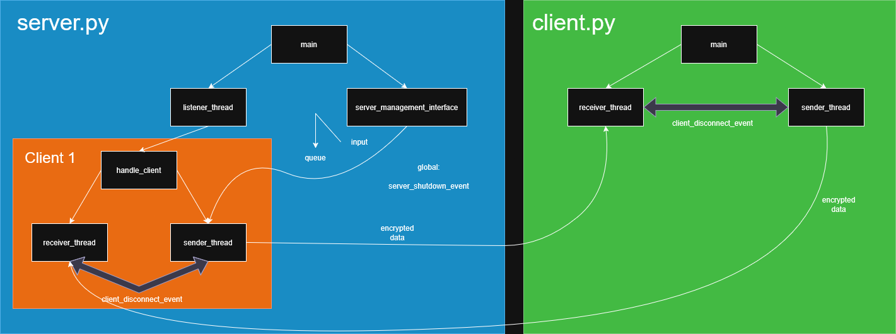

# ECDHE-Encrypted-Chat

## Overview

This project implements a secure client-server console-based chat app. It uses ECDHE (elliptic curve Diffie-Hellman ephemeral) to establish a shared key, and Fernet for encrypted communication. The server is designed to handle multiple concurrent clients, thanks to multithreading. Multithreading also allows for two-way communication. Great care was taken to ensure the multithreading implementation is secure. This is achieved via global variable locks, which ensure two threads cannot modify the same variable at the same time. We avoid deadlocks by establishing a global lock acqusition order. All the threads should close properly (graceful shutdown) so the daemon parameter is unnecessary.

## Features

*   **Secure Key Exchange:** Implements ECDHE for establishing a shared key for each session.
*   **Forward Secrecy:** We create a new pair of keys for each session, which ensures that in the event that keys get leaked, the security of future sessions is not compromised. That's the 'ephemeral' part.
*   **Authenticated Encryption:** Uses Fernet which handles the encryption and data integrity, making sure the message hasn't been tampered with.
*   **Multi-threaded Server:** Capable of handling multiple clients at the same time.
*   **Two-way Communication:** Duplex communication between the server and its clients.
*   **Graceful Shutdown:** Ensures all the threads close properly and frees up used resources. After a client disconnects a cleanup procedure makes sure to delete them from memory.
*   **Disconnection Handling:** Detects and responds to both graceful and abrupt client/server disconnections (via error handling).
*   **Command-Line Interface:** Simple server administration interface to manage clients and send messages.
*   **Error handling:** If an error occurs while communicating with a specific client, the error is contained and handled in that client's thread. Just because there is an issue with one of the client, doesn't mean that the server needs to shut down.
*   **Inter-thread communication:** We use two main ways of communicating between different threads. Global and local events, as well as queues.

## Architecture

Both the server and the client implement multithreading, though to different degrees.

Here's a visual representation of the thread architecture and communication flow:



### Server-Side Threads

The server's multi-threaded architecture allows it to manage simultaneous client connections and an interactive server administration interface.

*   **`main` thread:**
    *   Initializes global variables and their corresponding locks. This includes a list of client_ids and a dictionary which maps each client_id to a reference to that client's message queue. Also, a list of all the threads - `worker_threads`
    *   Parses command-line arguments (HOST, PORT).
    *   Starts the `listener_thread` and `server_management_interface` threads.
    *   Creates a global event: `server_shutdown_event`, which signals when it's time for the server to shut down.
    *   Waits until the `server_shutdown_event` global event is set. Alternatively, if there is a critical error with the server, it will shut down.
    *   Afterwards, wait for all the threads to close gracefully.

*   **`listener_thread`:**
    *   Binds and listens for incoming client connections on the specified HOST:PORT.
    *   Uses the timeout mechanic on the listening socket to periodically check the `server_shutdown_event`.
    *   For each new client connection:
        *   Creates variables relevant to that client: their `client_id` and their message queue.
        *   Updates the global variables `active_client_ids` and `client_message_queues` (under the corresponding locks).
        *   Creates a new `handle_client` thread to manage that specific client's session.

*   **`server_management_interface` thread:**
    *   Provides a command-line interface and handles the input.
    *   Displays a numbered list of currently active clients (a snapshot taken under a lock).
    *   The user must choose a client they want to switch to. Then it allows the user to send messages to the selected client.
    *   Typing `back` goes back to the client selection screen.
    *   Typing `exit` while conversing with a specific client will sever that connection.
    *   Typing `exit` while in the client selection screen will shut down the server and sever all client connections. This is done via the `server_shutdown_event`.
    *   Messages for clients are placed into their respective message queues.

*   **`handle_client` thread (per client):**
    *   This thread acts as a manager for a single client's session.
    *   It contains a `try...except...finally` block that covers the entire lifecycle of the client's connection.
    *   Generates ECDHE keys and performs the ECDHE handshake with the client.
    *   Derives the key using the `HKDF()` key derivation function (which itself uses the SHA256() algorithm). This derived key is used to initialize Fernet.
    *   Sets `conn.settimeout(0.5)` on the client's socket which is very important to make sure the program doesn't get stuck waiting in one spot.
    *   Creates a `sender_thread` and a `receiver_thread` to handle two-way communication for this particular client.
    *   Creates a `client_disconnect_event` (local to this client's session) to signal disconnections between its `sender` and `receiver` threads.
    *   Waits for both `sender_thread.join()` and `receiver_thread.join()` to ensure they finish.
    *   The `finally` block always calls `client_cleanup()`, guaranteeing resource release.

*   **`sender_thread` (Server-side, per client):**
    *   Responsible for sending encrypted messages from the server's administration interface to the client.
    *   Retrieves messages from the client's dedicated message queue (via the global dictionary) using `client_outgoing_queue.get(timeout=0.5)`, allowing it to check `server_shutdown_event` and `client_disconnect_event`. The timeout makes sure the program doesn't get stuck waiting for the queue to update, which might not happen.
    *   Encrypts messages using the session's `server_fernet` and sends them via `conn.sendall()`.
    *   Monitors for `BrokenPipeError`, `ConnectionResetError`, or other exceptions indicating client disconnection, and sets `client_disconnect_event` if detected.
    *   Sets `client_disconnect_event` if an "exit" message is received from the queue.

*   **`receiver_thread` (Server-side, per client):**
    *   Responsible for receiving encrypted messages from the client.
    *   Uses `conn.recv()`  to receive data. This method adheres to the timeout we set earlier in `handle_client()`.
    *   If `conn.recv()` returns an empty byte string (`b''`), it signifies a graceful client disconnection. If network errors occur, it catches `ConnectionResetError`, `BrokenPipeError`, etc. In both cases, it sets `client_disconnect_event`.
    *   Decrypts incoming messages using `server_fernet` and prints them to the server console, signaling which client sent that message.
    *   Sets `client_disconnect_event` if decryption fails (`InvalidToken` exception) or other errors occur.

### Client-Side Threads

The client's thread architecture is much simpler, only consisting of 2 sub-threads.

*   **`main` thread:**
    *   Parses command-line arguments (HOST, PORT).
    *   Establishes the initial socket connection (`s.connect()`) to the server.
    *   Performs the ECDHE handshake to establish a shared secret key.
    *   Derives the key using HKDF(), and iniializes Fernet. Same as the server script.
    *   Sets the timeout on the client's socket (for the same reasons as the server)
    *   Creates a `disconnect_event` (local to the client's session) to signal disconnections between its `sender` and `receiver` sub-threads.
    *   Creates `sender_thread` (client-side) and `receiver_thread` (client-side).
    *   Waits for the `disconnect_event`, after which both `sender_thread` and `receiver_thread` are joined in the `finally` block 
    *   `with socket.socket(...)` ensures the client's socket is properly closed when exiting the `with` block.
    *   Handles `KeyboardInterrupt` to ensure graceful shutdown even in that event.

*   **`sender_thread` (Client-side):**
    *   Responsible for sending encrypted messages from the client's user input to the server.
    *   Prompts the user for input.
    *   Encrypts messages using the `client_fernet`.
    *   Sends encrypted messages via `s.sendall()`.
    *   Sets `disconnect_event` if the user types "exit" or if any sending errors occur.

*   **`receiver_thread` (Client-side):**
    *   Responsible for receiving encrypted messages from the server.
    *   Uses `s.recv()` to receive data.
    *   If `s.recv()` returns `b''`, it signifies a graceful server disconnection. If network errors occur, it catches `ConnectionResetError`, `BrokenPipeError`, etc. In both cases, it sets `disconnect_event`.
    *   Decrypts incoming messages using `client_fernet` and prints them to the client console.
    *   Sets `disconnect_event` if decryption fails (`InvalidToken`) or other errors occur.

## Getting Started

### Prerequisites

*   Python 3.8+
*   `cryptography` library

### Installation

**Clone the repository:**
    ```bash
    git clone https://github.com/AdamBojek/ECDHE-encrypted-chat.git
    ```

### Usage

#### Running the Server

To start the server:

```bash
python server.py [HOST] [PORT]
```

The arguments are the ip address and the port number on which the server will listen.
The default arguments are `127.0.0.1` and `65432`.

#### Running the client

The syntax is the same as for the server

```bash
python client.py [HOST] [PORT]
```

Here, the [HOST] and [PORT] are the ip address and port number of the server.
The default arguments are `127.0.0.1` and `65432`.

## License

This project is licensed under the MIT License. See the LICENSE file for details.
